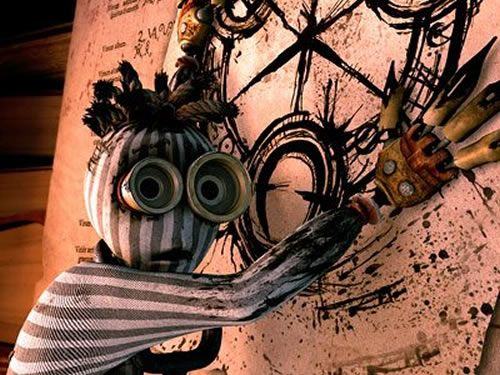

# *Boolos' Brewery*

Try your hand at the logic puzzle(s) presented in the video [Solving one of the logic puzzles of all time](https://www.youtube.com/watch?v=uUPr07ThSH0)!
While you don't *technically* need to watch the video, it probably helps to.

1. [The main predicament](#the-main-predicament)
1. [Try it yourself!](#try-it-yourself)
   1. [Clarifications](#clarifications)
   1. [Variants (and other features)](#variants-and-other-features)
1. [Test your strategy!](#test-your-strategy)
   1. [High scores](#high-scores)


# The main predicament

You are at a local beer garden (Boolos' Brewery) with your colleagues Alice, Bob, and Charlie.
You're colleagues, but you're not that close.
You know that one of them is a mathematician, one is a physicist, and one is an engineer, but you can't remember who is who, and their general demeanours aren't helping you figure it out.

As the night grows late, you notice that all three of your colleagues are quite drunk.
Since they won't remember the conversation anyway, now is probably your best chance to figure out who studies in what field.
However, since they're so drunk:
1. You can only get the attention of **one colleague at a time** to ask a question.
   This means you can't ask a question to multiple colleagues simultaneously.
1. Your colleagues' reduced mental capacities mean that they're only capable of answering **yes/no questions**.

This may seem simple enough, but there's a catch.
You see, you yourself are a computer scientist.
During the night, your colleagues decided that it would be "fun and quirky" to only speak to you in `foo`s and `bar`s.
You don't remember how this decision came about, as you are also pretty drunk.
1. The mathematician made some decision on how to map `foo` and `bar` to "yes" and "no", but you don't remember what the assignment was.
1. Whatever conventions the mathematician chose, you figure that the physicist will commit to the complete opposite convention; e.g., if the mathematician would say `foo` to mean "yes", then the physicist would say `bar` to mean "yes".
1. The engineer was oddly quiet during this conversation.
   It's safe to assume that the engineer wasn't paying much attention to the conversation, since it was frivolous musing.
   Now that everyone is using `foo` and `bar`, though, the engineer is trying to catch up with the trend.
   However, since they weren't paying attention, **the engineer will randomly choose `foo` or `bar` as a response to any yes/no question.**

How many directed yes/no questions do you need to determine everyone's field of expertise?

> [!NOTE]
> This is a classic logic puzzle.
> You can determine everyone's field of expertise using only **three questions.**

> [!TIP]
> Find the predicament too easy (or too hard)? Check out the [variants](docs/variants.md)!

# Try it yourself!

You could try to gather a few friends and play it the old-fashioned way, but let's be realistic.

Assuming you [*suivez le rythme du temps*](https://www.rust-lang.org/tools/install), you can get the game going with

```sh
cargo run
```

Once the game is up and running, marvel at the text-based conversation-simulator!

Every question must be directed to someone, and **must end with a `?`**.

```yaml
Bob: Charlie studies engineering implies Alice studies mathematics?
# perhaps Bob will say "Foo."
```

If you're not sure how to formulate your questions, or you're not sure what's possible, consult the [grammar](docs/syntax.md).

## Clarifications

Unlike the original logic puzzle, I don't need to clarify anything.



Nonetheless, I'll provide some clarifications:

1. You may ask the same person multiple questions, and your questions may depend on previous responses you've heard.
1. If you direct a question to the engineer, the content of your question has no bearing on the response; their response will be ["random"](https://rust-random.github.io/rand/rand/rngs/struct.ThreadRng.html).
1. If you, e.g., ask Alice how Bob will respond to a certain question, and Bob happens to be the engineer, Alice is going to make an "educated guess" about what Bob would say (i.e, her response may be "random").

## Variants (and other features)

If you would like to play the easier or harder [variants](docs/variants.md), just enable the corresponding feature:
```sh
cargo run --features "easy"
cargo run --features "hard"
# the quotation marks are intentional
```

For any version of the game, you can de-randomise it (for science?) with the `derand` feature, e.g.:
```sh
cargo run --features "hard derand"
```

> [!WARNING]
> "Just use `derand` :smirk:." is **not** a solution to any of the puzzle variants.

If you want more questions than the game allows, add the `endless` feature.
```sh
cargo run --features "easy endless"
```
When you think you've figured out everyone's professions, you can just enter `done` (don't worry, the UI will remind you of this).

# Test your strategy!

If you think you have worked out a solution to this puzzle or its variants:

1. Fork this repository!
1. [Write up your strategy](docs/test_strategy.md#writing-your-own-strategy), and save it to a `.py` file in the `submissions/` folder.
1. Test your strategy by running
   ```sh
   python3 test_strategy.py
   ```
1. If your strategy passes all test cases, [make a pull request](docs/test_strategy.md#submitting-your-strategy) to be added to the [high scores](#high-scores) below.

## High scores
- :trophy: [Easy mode high scores](submissions/public/easy/README.md)
- :trophy: [Default mode high scores](submissions/public/default/README.md)
- :trophy: [Hard mode high scores](submissions/public/hard/README.md)

> [!TIP]
> Although submissions are ranked first and foremost by number of questions asked, they are also scored based on "minimal complexity". Even if you can't beat \#1, I strongly encourage you to submit your solutions!